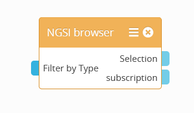
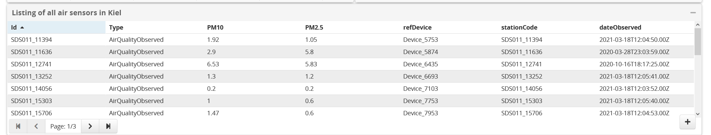
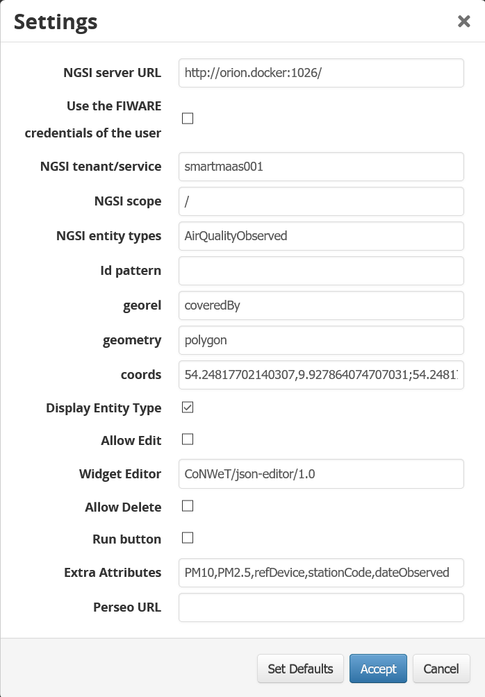

<h2 align="center">
  <a href="https://smart-maas.eu/en/"></a>
  <br>
      SMART MOBILITY SERVICE PLATFORM
  <br>
  <a href="https://smart-maas.eu/en/"></a>
  <br>
</h2>

<p align="center">
  <a href="mailto:info@smart-maas.eu">Contact</a> •
  <a href="https://smart-maas.eu/en/">Project Page</a>
</p>


***

<h1 align="center">
  <a>
    NGSI Browser widget
  </a>
</h1>

***


[](https://www.fiware.org/developers/catalogue/)


The NGSI Browser widget allows you to browser [Orion Context
Broker](http://catalogue.fiware.org/enablers/publishsubscribe-context-broker-orion-context-broker)
servers in an easy and paginated way. This is done using the `queryContext`, so
updates made into the context broker are not reflected immediately when using
this widget.

<p align="center">
    
</p>

> Latest version of this widget is available in this github repositories where you
> can make use of it on the [Mashup portal](https://mashup.lab.fiware.org).
> Remember to take a look into the example mashups provided in the OrionStarterKit offering.

### Visualization example

Retrieving AirQualityObserved NGSIv2 data

<p align="center">
    
</p>

### Settings

<p align="center">
    
</p>

Build
-----

Be sure to have installed [Node.js](http://node.js). For example, you can install it on Ubuntu and Debian running the following commands:

```bash
curl -sL https://deb.nodesource.com/setup | sudo bash -
sudo apt-get install nodejs
sudo apt-get install npm
```

Install other npm dependencies by running:

```bash
npm install
```

For build the widget you need download grunt:

```bash
sudo npm install -g grunt-cli
```

And now, you can use grunt:

```bash
grunt
```

If everything goes well, you will find a wgt file in the `dist` folder.


## Documentation

Documentation about how to use this widget is available on the
[User Guide](src/doc/userguide.md). Anyway, you can find general information
about how to use widgets on the
[WireCloud's User Guide](https://wirecloud.readthedocs.io/en/stable/user_guide/)
available on Read the Docs.


## Copyright and License

Copyright (c) 2016 CoNWeT Lab., Universidad Politecnica de Madrid

Licensed under the Apache License, Version 2.0 (the "License");
you may not use this file except in compliance with the License.
You may obtain a copy of the License at

  http://www.apache.org/licenses/LICENSE-2.0

Unless required by applicable law or agreed to in writing, software
distributed under the License is distributed on an "AS IS" BASIS,
WITHOUT WARRANTIES OR CONDITIONS OF ANY KIND, either express or implied.
See the License for the specific language governing permissions and
limitations under the License.
